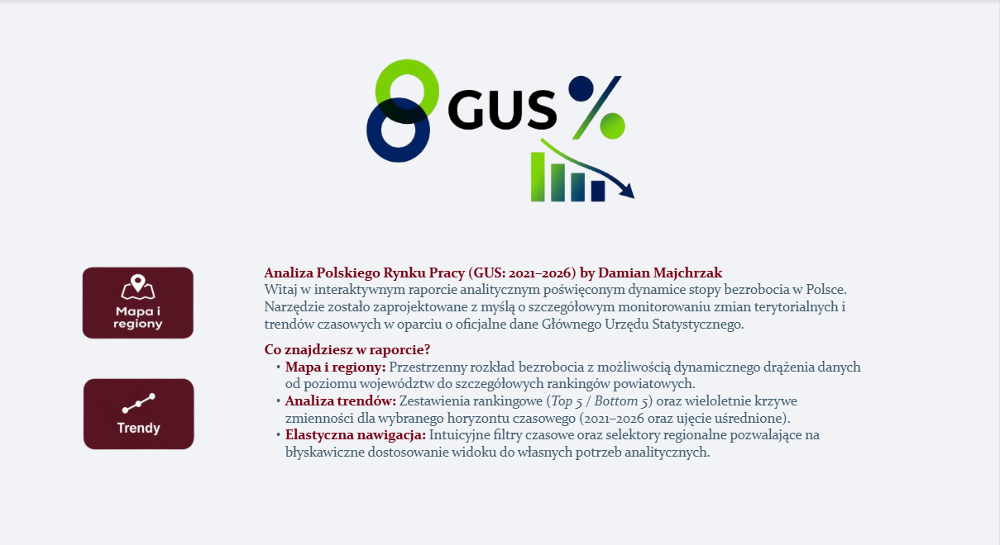
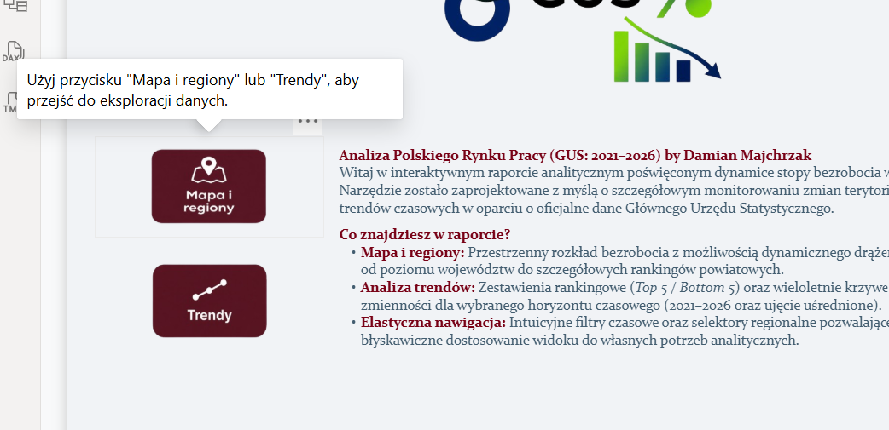
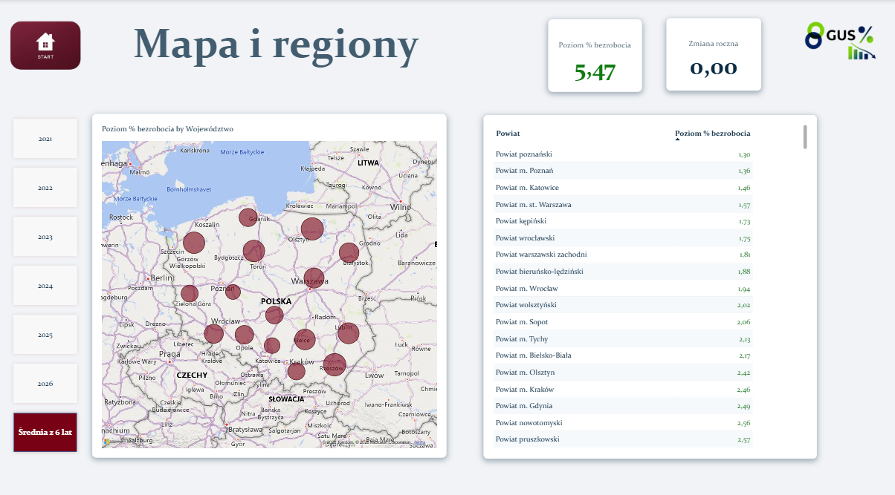
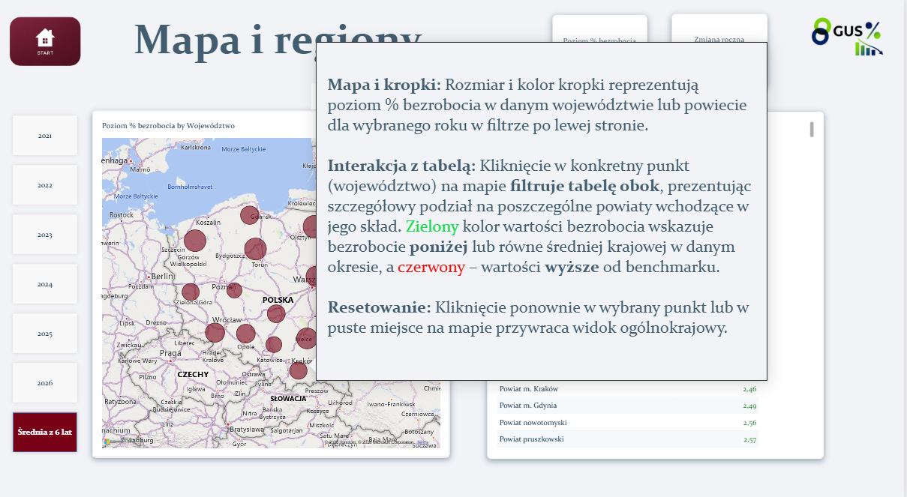
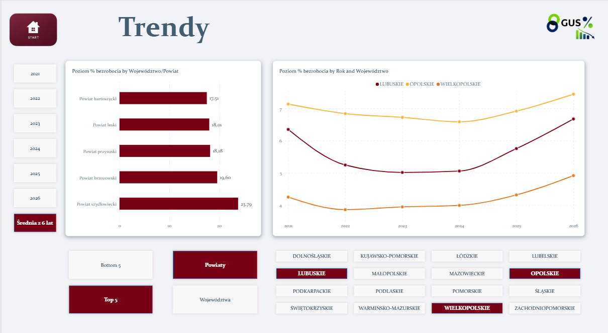
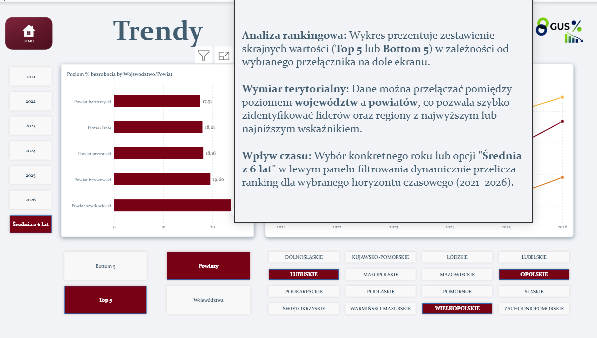

# 📊 Analiza Polskiego Rynku Pracy – GUS

Interaktywny projekt analityczny w **Power BI**, przedstawiający poziom bezrobocia w Polsce w latach **2021–2026** na podstawie danych Głównego Urzędu Statystycznego (GUS).

Projekt łączy analizę danych na poziomie **województw i powiatów**, dynamiczny wybór okresu, ranking **Top 5 / Bottom 5**, analizę trendów oraz interaktywną mapę Polski.

---

## 🎯 Cel projektu

Celem projektu było stworzenie przejrzystego i interaktywnego raportu umożliwiającego szybką analizę poziomu bezrobocia w Polsce w ujęciu:

- czasowym,
- terytorialnym,
- rankingowym,
- porównawczym.

Raport został zaprojektowany tak, aby użytkownik mógł w prosty sposób przejść od ogólnego obrazu sytuacji na rynku pracy do szczegółowej analizy wybranego regionu.

---

## 📈 Zakres analizy

Raport umożliwia analizę:

- poziomu bezrobocia w latach **2021–2026**,
- średniej wartości bezrobocia z całego analizowanego okresu,
- województw,
- powiatów,
- **Top 5** obszarów o najwyższym poziomie bezrobocia,
- **Bottom 5** obszarów o najniższym poziomie bezrobocia,
- zmian wartości w czasie,
- różnic pomiędzy poszczególnymi regionami.

---

## 🗂️ Źródło danych

Dane wykorzystane w projekcie pochodzą z:

**Głównego Urzędu Statystycznego (GUS)**

Zakres danych wykorzystany w raporcie obejmuje lata:

**2021–2026**

Dane zostały przygotowane i przekształcone w taki sposób, aby mogły zostać wykorzystane w modelu danych Power BI.

---

## 🧩 Model danych

Projekt wykorzystuje uporządkowany model danych oparty na rozdzieleniu danych faktowych od wymiarów.

### Główne elementy modelu:

- `FACT_projektBezrobocie_GOLD` – tabela faktów zawierająca wartości bezrobocia,
- `DIM_Date_Table` – tabela dat,
- `DIM_Geo_GOLD` – wymiar geograficzny,
- `Filtry_Lat` – parametr wyboru roku / średniej,
- `Parametr_Poziom` – parametr wyboru poziomu analizy,
- `Parametr_TopBottom` – parametr wyboru rodzaju rankingu.

Takie podejście pozwala na oddzielenie danych od logiki sterującej raportem oraz zapewnia większą elastyczność przy budowie miar DAX.

---

## 🛠️ Przygotowanie danych

Proces przygotowania danych obejmował m.in.:

- uporządkowanie danych źródłowych,
- przygotowanie struktury geograficznej,
- przygotowanie tabel wymiarów,
- utworzenie tabeli dat,
- przygotowanie modelu relacyjnego,
- przygotowanie danych do analizy na poziomie województw i powiatów.

---

# 🧠 Logika DAX

Jednym z głównych elementów projektu jest dynamiczna logika DAX pozwalająca użytkownikowi zmieniać sposób prezentacji danych bez konieczności tworzenia osobnych wizualizacji dla każdego wariantu.

### 📅 Dynamiczny wybór roku

Raport umożliwia wybór:

- 2021,
- 2022,
- 2023,
- 2024,
- 2025,
- 2026,
- **Średnia z 6 lat**.

Wybór roku realizowany jest poprzez odłączoną tabelę parametrów oraz `SELECTEDVALUE`.

Do przekazania wybranego roku do tabeli dat wykorzystywana jest funkcja:

```DAX
TREATAS(
    { VALUE(WybranaOpcja) },
    'DIM_Date_Table'[Year]
)
```

Dzięki temu jedna miara może obsługiwać różne warianty analizy.

---

## 🏙️ Województwa vs Powiaty

Raport pozwala dynamicznie zmienić poziom analizy:

- **Województwa**
- **Powiaty**

Parametr:

```text
Parametr_Poziom
```

steruje logiką odpowiedzialną za wybór właściwego poziomu agregacji.

Pozwala to wykorzystać te same wizualizacje do analizy dwóch różnych poziomów geograficznych.

---

## 🏆 Top 5 / Bottom 5

Raport posiada dynamiczny ranking:

- **Top 5** – najwyższe wartości bezrobocia,
- **Bottom 5** – najniższe wartości bezrobocia.

Ranking jest obliczany dynamicznie w zależności od:

- wybranego poziomu geograficznego,
- wybranego roku,
- wybranego kierunku rankingu.

Logika rankingu wykorzystuje m.in.:

```DAX
FILTER()
COUNTROWS()
VALUES()
REMOVEFILTERS()
```

oraz dynamiczną miarę wartości bezrobocia.

---

## 🔢 Obsługa remisów

Ranking został zaprojektowany tak, aby **nie eliminować automatycznie remisów**.

Jeżeli kilka obszarów posiada taką samą wartość na granicy Top 5 lub Bottom 5, wszystkie takie obszary zostają uwzględnione.

Przykładowo:

> Jeżeli pozycję 5 zajmują trzy regiony z identyczną wartością, raport może pokazać więcej niż 5 pozycji.

Jest to świadomie przyjęta zasada biznesowa:

**Top/Bottom 5 oznacza pięć najlepszych/najsłabszych pozycji rankingowych, z uwzględnieniem wszystkich remisów na granicy.**

---

# 📑 Struktura raportu

Raport składa się z trzech głównych obszarów.

---

## 🏠 Strona startowa

Strona startowa pełni funkcję punktu wejścia do raportu.

Zawiera:

- tytuł projektu,
- krótką informację o zakresie analizy,
- logo GUS,
- przyciski nawigacyjne,
- krótką instrukcję korzystania z raportu,
- dodatkowy tooltip wyjaśniający sposób poruszania się po raporcie.

Dostępne są dwa główne kierunki analizy:

**🗺️ Mapa i regiony**

oraz

**📈 Trendy**

---

## 🗺️ Mapa i regiony

Strona służy do analizy przestrzennej poziomu bezrobocia.

Zawiera:

- interaktywną mapę Polski,
- tabelę regionów,
- wybór roku,
- możliwość wyboru średniej z 6 lat,
- wartości KPI,
- interakcje pomiędzy mapą i tabelą.

Mapa umożliwia szybkie zidentyfikowanie różnic pomiędzy poszczególnymi obszarami.

Dodatkowy tooltip wyjaśnia m.in.:

- znaczenie wielkości punktów,
- znaczenie kolorów,
- sposób działania zaznaczenia,
- wpływ interakcji na pozostałe elementy raportu,
- sposób powrotu do widoku bazowego.

### 🧭 Nawigacja

W lewym górnym rogu strony znajduje się przycisk:

**START**

który umożliwia powrót do strony głównej raportu.

---

## 📈 Trendy

Strona służy do analizy rankingowej oraz czasowej.

Użytkownik może wybrać:

- **Top 5 / Bottom 5**,
- **Województwa / Powiaty**,
- rok,
- średnią z 6 lat,
- konkretny region do dalszej analizy.

Na stronie znajduje się również wykres przedstawiający zmianę poziomu bezrobocia w latach **2021–2026**.

### 🧭 Nawigacja

W lewym górnym rogu znajduje się przycisk:

**START**

umożliwiający powrót do strony startowej.

Dzięki temu użytkownik może swobodnie przechodzić pomiędzy głównymi obszarami raportu.

---

# 🖱️ Interaktywność i UX

Projekt został zaprojektowany z naciskiem na prostą i intuicyjną obsługę.

### Najważniejsze elementy interaktywne:

- dynamiczny wybór roku,
- wybór średniej z 6 lat,
- przełączanie Województwa / Powiaty,
- przełączanie Top 5 / Bottom 5,
- interakcje pomiędzy wizualizacjami,
- filtrowanie danych,
- dynamiczny ranking,
- analiza wybranego regionu,
- przyciski nawigacyjne,
- tooltips kontekstowe.

Celem było ograniczenie liczby wizualizacji potrzebnych do przedstawienia różnych wariantów analizy i wykorzystanie logiki DAX do sterowania raportem.

---

# 🧪 Testowanie i walidacja

Raport został sprawdzony również pod kątem poprawności działania logiki biznesowej.

Walidacja obejmowała m.in.:

### 1. Wybór lat

Sprawdzono działanie wszystkich dostępnych wariantów:

- 2021,
- 2022,
- 2023,
- 2024,
- 2025,
- 2026.

### 2. Średnia z 6 lat

Zweryfikowano, czy wartość:

**„Średnia z 6 lat”**

uwzględnia cały dostępny zakres danych 2021–2026.

### 3. Poziom geograficzny

Sprawdzono przełączanie pomiędzy:

- Województwami,
- Powiatami.

### 4. Ranking

Zweryfikowano:

- Top 5,
- Bottom 5,
- poprawność kolejności,
- obsługę remisów,
- zgodność wartości pomiędzy tabelą i wykresem.

### 5. Spot-check danych

Wybrane wartości zostały porównane poprzez ścieżkę:

```text
Dane źródłowe
      ↓
Tabela FACT
      ↓
Miara DAX
      ↓
Ranking
      ↓
Wizualizacja
```

Takie podejście pozwoliło sprawdzić nie tylko sam wygląd raportu, ale również poprawność działania logiki stojącej za wizualizacjami.

---

# 💻 Technologie

Projekt został przygotowany z wykorzystaniem:

- **Power BI**
- **DAX**
- **Power Query**
- **GUS Open Data**
- **Git / GitHub**

---

# ⚙️ Najważniejsze elementy techniczne

Projekt obejmuje m.in.:

- modelowanie danych w Power BI,
- tabelę faktów i wymiary,
- tabelę dat,
- odłączone tabele parametrów,
- dynamiczne miary DAX,
- `SELECTEDVALUE`,
- `SWITCH`,
- `CALCULATE`,
- `AVERAGE`,
- `TREATAS`,
- `FILTER`,
- `VALUES`,
- `COUNTROWS`,
- `REMOVEFILTERS`,
- dynamiczny ranking,
- obsługę remisów,
- interakcje pomiędzy wizualizacjami,
- nawigację pomiędzy stronami,
- tooltips.

---

# 🧠 Umiejętności zaprezentowane w projekcie

Projekt pokazuje praktyczne wykorzystanie:

- analizy danych,
- modelowania danych,
- Power BI,
- języka DAX,
- Power Query,
- projektowania dashboardów,
- UX raportów BI,
- pracy z danymi publicznymi,
- tworzenia dynamicznych wizualizacji,
- testowania poprawności logiki biznesowej.

Szczególny nacisk położono na połączenie:

**model danych → DAX → wizualizacja → interakcja → walidacja**

---

# 🚀 Możliwe kierunki rozwoju

Projekt może zostać w przyszłości rozszerzony o:

- dodatkowe lata danych,
- analizę innych wskaźników rynku pracy,
- porównanie bezrobocia z innymi zmiennymi ekonomicznymi,
- dodatkowe poziomy agregacji,
- bardziej szczegółową analizę zmian rok do roku,
- dodatkowe KPI,
- automatyzację procesu pobierania i aktualizacji danych,
- dodatkowe wizualizacje geograficzne.

---

# 📸 Screenshots

## 🏠 Strona startowa



## 💡 Tooltip – strona startowa



## 🗺️ Mapa i regiony



## 💡 Tooltip – mapa i regiony



## 📈 Trendy



## 💡 Tooltip – trendy



---

# 📁 Zawartość repozytorium

Przykładowa struktura projektu:

```text
📦 Analiza-Polskiego-Rynku-Pracy-GUS
│
├── 📊 Power BI
│   └── Analiza_Polskiego_Rynku_Pracy_by_DamianMajchrzak.pbix
│
├── 📸 screenshots
│   ├── dashboard_landing.png
│   ├── dashboard_landing_tooltip.png
│   ├── dashboard_map_regions.png
│   ├── dashboard_map_tooltip.png
│   ├── dashboard_trends.png
│   └── dashboard_trends_tooltip.png
│
├── 📄 README.md
└── 📂 data
    └── ...
```


---

# 👨‍💻 Autor

**Damian Majchrzak**

Początkujący Analityk Danych / BI Developer rozwijający umiejętności w zakresie:

**Power BI • DAX • SQL • ETL • Data Analysis • Data Visualization**

Projekt jest częścią mojego portfolio analitycznego.

---

⭐ Jeśli projekt jest interesujący, zapraszam do przejrzenia pozostałych projektów znajdujących się w moim portfolio.
